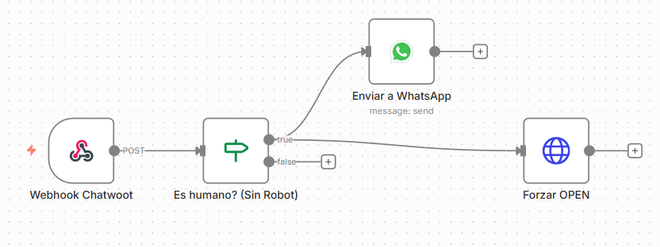
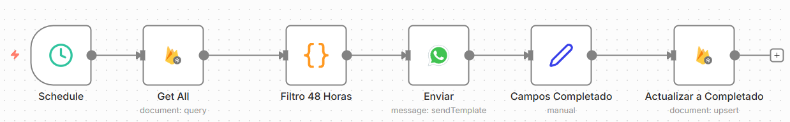
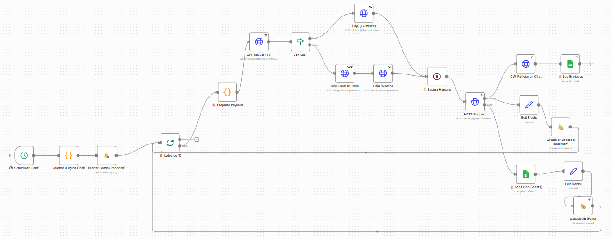

# Autonomous Multi-Agent Sales Ecosystem 🤖

**A production-grade autonomous sales orchestrator deployed in the education sector.**

This repository contains the source code for a modular AI system designed to automate end-to-end sales processes, moving beyond simple Q&A bots to a full "Sales Engineer" agent capable of context retention, objection handling, and autonomous closing.

## 🏗 System Architecture

The ecosystem is built on a **Micro-Workflow Architecture** using **n8n** as the orchestrator. It integrates the following stack:

* **Cognitive Engine:** Gemini 1.5 Pro (via Google Vertex AI/Studio).
* **State & Vector Store:** Google Firestore (NoSQL).
* **Human Interface:** Chatwoot (Open Source CRM).
* **Channel:** WhatsApp Business API (Meta).

## 🧩 Modules Overview

The system is composed of 4 synchronized workflows acting as independent services:

### 1. Core Agent (`sales_agent_workflow.json`)
The central brain of the operation. Handles intent classification, RAG retrieval, and autonomous closing logic.

### 2. Human Bridge Middleware (`chatwoot_bridge.json`)
A bi-directional synchronization layer between WhatsApp and Chatwoot. It ensures smooth "Human Handoff" by filtering bot messages and managing conversation status.

### 3. The Hunter - Retention Loop (`retention_loop_hunter.json`)
An asynchronous state machine for lead recovery. It monitors the database for leads stuck in "Pending" state for 48h and triggers a re-engagement message.

### 4. Campaign Batch Launcher (`campaign_batch_launcher.json`)
A batch-processing workflow for mass outreach. It reads leads from Sheets and executes messaging campaigns respecting Meta's API rate limits.

## 🚀 Key Technical Features

* **State Management:** Unlike stateless LLM calls, this system maintains long-term memory of the user's journey in Firestore.
* **Offline-First Data Sync:** Integrated with a custom Android Data Collection App to handle leads from physical trade fairs.
* **Guardrails:** Includes strict prompt engineering to prevent hallucination and enforce business rules (e.g., "Never invent prices").

## 🛠 Deployment

1.  **Prerequisites:** Self-hosted n8n instance, Google Cloud Service Account (Firestore), and WhatsApp Business API credentials.
2.  **Installation:** Import the `.json` files into n8n.
3.  **Configuration:** Replace the placeholder credentials (`YOUR_API_KEY`, `YOUR_SHEET_ID`) with your production keys.

---
*Authored by **Victor Altamirano** - Physicist & AI Engineer*
